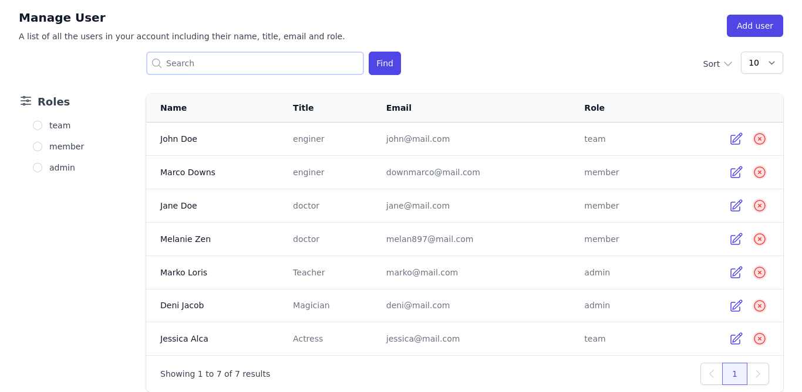
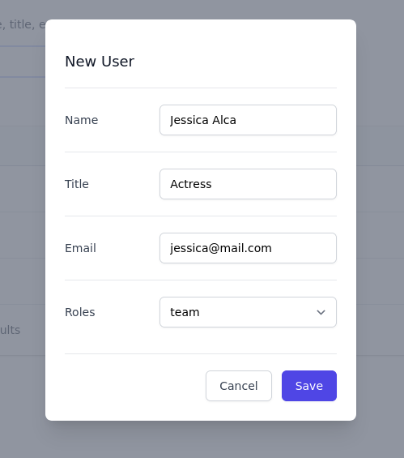
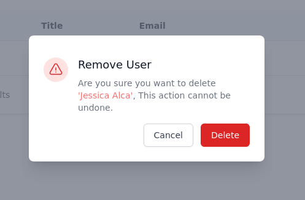
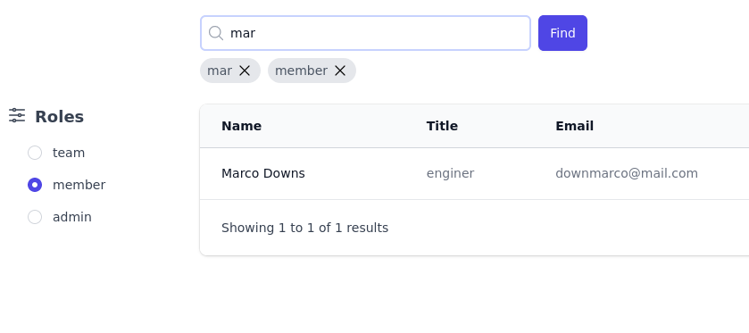
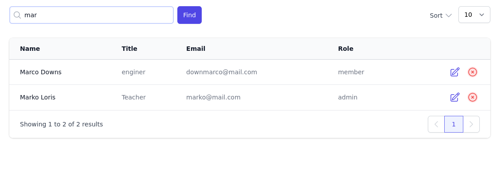
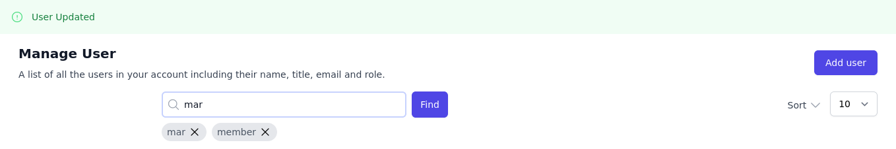

# Managing User with Vue 3 + Tailwind
> Notes : currently i'm using `json-server` run on port 3000 for mocking server, if you have active server edit file `server.js` 

## Install

`npm install `

## Run the app

`npm run dev`

## Additional for json-server

if you have `json-server` on your machine use file `users.json` and run 

> `json-server users.json`

## Screenshot

### Add User

### Delete User

### Filter

### Search

### Notification

